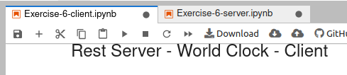

# Codex-Test
My attempt to solve some exercises from CODEX - Pre-Qualification Test (V1.11) - Summer Internship    
All the code was written in python using Jupyter notebooks for an easier execution.   
# Running the exercises:

## This Repository does not need to be downloaded, the primary way of executioning it is the following:
- Click the badge below to access a virtual environment containing this repository (might take a little while to build).   
    [](https://mybinder.org/v2/gh/ahendler/Codex-Test/main)
- Browse using the left side panel to the src folder and open the desired notebook.      
Step 1:     
      
Step 2:      
    
- Click the button shown below to restart the kernel and run all cells:   
        
    ####  It is also possible to run one by one using the play button

### An alternative to the previous method is to access this notebooks using google colab via this [link](https://colab.research.google.com/github/ahendler/Codex-Test). Note that some examples (as the database one) might not work since it does not build the whole repository as Binder does. In this cases, it is possible to just access the files preview here on github (using the links below) and download and run them locally if needed (Using VS Code for example).
    
# Details:
## [Exercise 1](src/Exercise-1/Exercise-1.ipynb) - Validate CNPJ format and check digits:
- Done using Unit Tests. Final tests execution:   


## [Exercises 2 and 3](src/Exercise-2-and-3/Exercise-2-and-3.ipynb) - Rectangles intersection and area of intersection:
- As they deal with the same object, they were implemented in the same class as ```intersects``` and ```areaOfIntersection``` funtions
- Testing output:    


## [Exercise 4](src/Exercise-4/Exercise-4.ipynb) - Simple ToDo List:
- Implemented using pandas to manage the list in the memory and a csv file for persistence. Last OutPut:  


## [Exercise 5](src/Exercise-5/Exercise-5.ipynb) - Rest Client - World Clock:
- As this is expected to be executed remotely (binder), the machine and the user might be in different timezones, as such, an aditional function to show São Paulo's time was added. 
- Python's standart datetime module [documentation](https://docs.python.org/3/library/datetime.html) was used to manage timezone transformations.    
    
##### Note that they might still be same in some occasions

## [Exercise 6](src/Exercise-6/Exercise-6-server.ipynb) - Rest Server - World Clock:
- This Exercise was split in two notebooks, one running the REST server and another the REST client.   
- For the REST server, the module Flask was used, making it easy to create and configure an API.
- For the REST client, the module requests was used, as in the last exercise.        
   
 - For this exercise both notebooks must be open and the server one must be running before starting the client one:   
 

## [Exercise 7](src/Exercise-7/Exercise-7.ipynb)- Entity Relationship Diagram - Simple Order Manager:
- Diagram elaborated:    
   
- Extra:
SQL querie using a simple instance of the Model above:   
    
